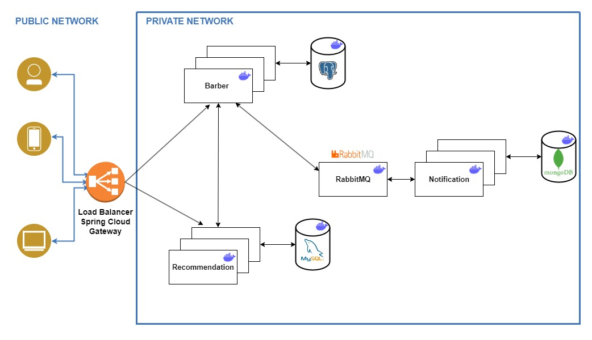

## Microservices Sample Starter 

This repository serves as a starting point for working with microservices. Currently, it features three services: `Barber`, `Recommendation`, `Notification` which interact with each other. 
Apart from these, there's also an `Eureka Server` managing requests between instances. 

Spring `OpenFeign` is used, making it easy to create REST clients by defining interfaces and eliminating boilerplate code.
Furthermore, a `Notification` service is implemented to store all requests made to other instances. Tracking has also been implemented. 

Each of the three services `(Barber, Recommendation, and Notification)` is connected to its respective `PostgreSQL`, `MySQL`  and `MongoDB` databases.

This project is an excellent starting point for developing microservices applications. 


## Technologies

The application is built using `Spring Boot 3.1.2` version and the following frameworks and technologies:

- Spring: Boot, Cloud, Framework, Data
- Hibernate
- Maven
- PostgreSQL, MySQL, MongoDB
- RabbitMQ
- Tracing with observing tool Zipkin (runs on `localhost:9411`)
- Docker
- Lombok
- Spring Cloud Gateway - Load Balancer on port 8083
- Kubernetes - [branch](https://github.com/viepovsky/microservices-app/tree/local_kubernetes) without EurekaServer and Spring Cloud Gateway

## How to run

To launch the application, execute `docker compose up -d`. 
To test the functionality, perform a POST request on the Load Balancer endpoint at `localhost:8083/api/v1/barbers` using the following request body:

```json
{
    "firstName": "Name",
    "lastName": "LastName",
    "company": "BarberDream",
    "email": "barber@gmail.com"
}
```
Before performing request check availibility of all services - http://localhost:8761/

You can also track the request - http://localhost:9411/

## Future development of the repo

Future enhancements include introducing Kafka/~~RabbitMQ~~ :white_check_mark: queues and other improvements.
Deployment to AWS using Kubernetes is on the roadmap, and the project is continuously evolving.

## Actual repo microservice schema 



##### This repository is still in development and is constantly being improved.
